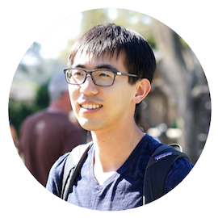

{:refdef: style="text-align: center;"}

{:refdef}

Hello, my name is [Jianneng](https://www.linkedin.com/in/jianneng-li-9970571b/){:target="_blank"}. I am currently a co-founder at [Navvable](https://navvable.com/){:target="_blank"} in Northern California, building modern workflow software for immigration law firms.

Previously, I was a Software Engineer at [Workday](https://www.workday.com/){:target="_blank"}. My work there focused on distributed systems and data processing, specifically using Apache Spark, Hadoop, as well as JVM-based languages and libraries.

I was born in Harbin, China, where I grew up and finished elementary school. Then I moved to Toronto, Canada, and stayed there until the end of high school. Next, I went to Cornell University in the east coast of US for undergrad, before coming to UC Berkeley in the west coast for master's. It can be a bit of a struggle when people ask me where I'm from.

I used to be involved in the speedcubing scene, and competed to solve the Rubik's cube and variants as quickly as possible. These days, while I always have a cube by my desk, I mostly play with it when waiting for code to compile. I do like to think that I had [some real potential](https://www.worldcubeassociation.org/persons/2009LIJI02){:target="_blank"} though.

Sword and Signals is my personal blog. I intend to use it to share some of my learnings and musings over the years.
